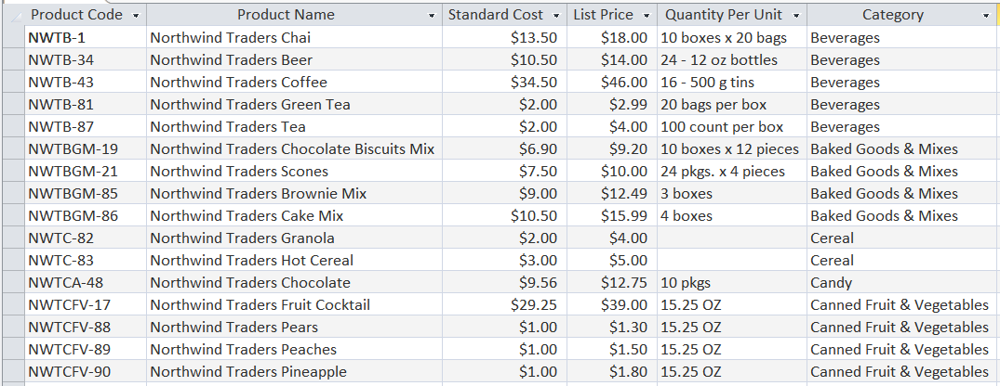
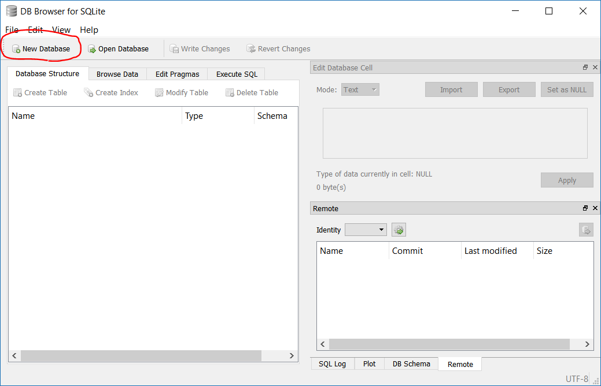
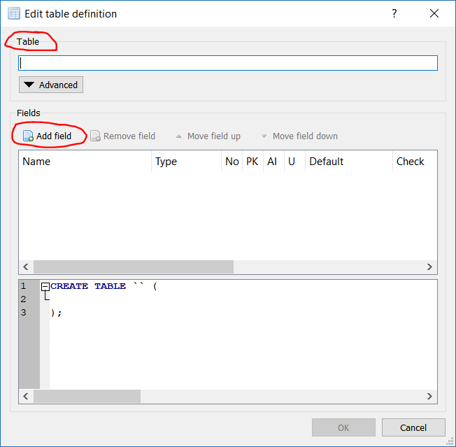
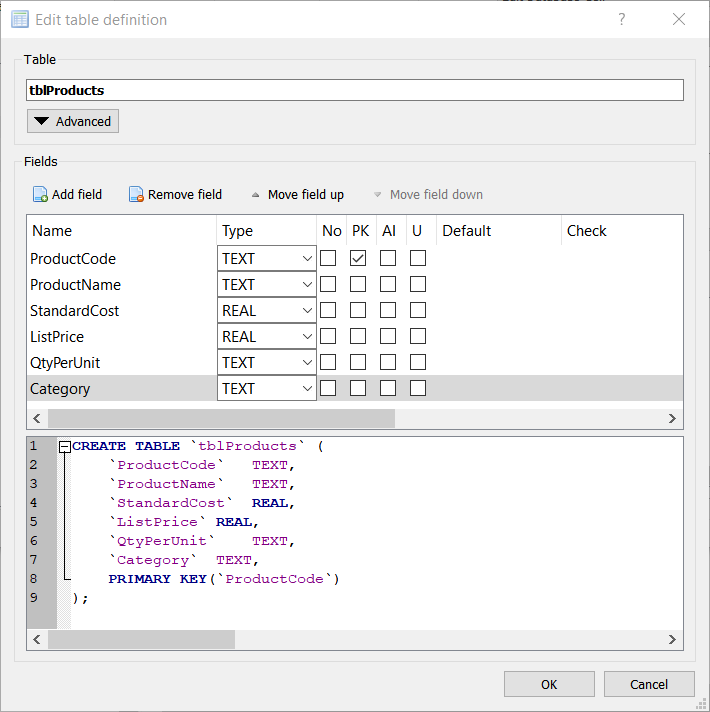
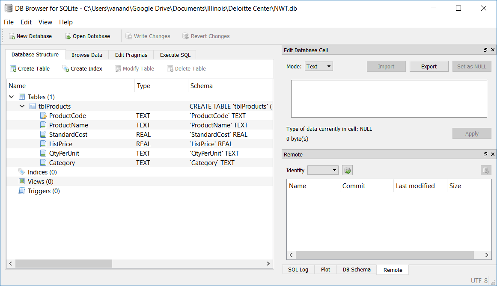

# An Introduction to Databases for Accountants
  
## Author Information
  
Vic Anand, Ph.D.
Assistant Professor of Accountancy - University of Illinois at Urbana-Champaign
R.C. Evans Data Analytics Fellow - University of Illinois-Deloitte Foundation Center for Business Analytics<a href="#footnote1"><sup>[1]</sup></a>
  
## Table of Contents
  
  
* [0. Learning Objectives](#0-learning-objectives )
* [1. Introduction](#1-introduction )
	* [1.1. Company Description](#11-company-description )
	* [1.2. Introduction to Databases](#12-introduction-to-databases )
		* [1.2.1. Common Brands of Databases](#121-common-brands-of-databases )
		* [1.2.2. Client-Server vs. Embedded Databases](#122-client-server-vs-embedded-databases )
	* [1.3. Prerequisites](#13-prerequisites )
* [2. Creating a Database with Tables for Customers and Products](#2-creating-a-database-with-tables-for-customers-and-products )
	* [2.1. Create a Blank Database](#21-create-a-blank-database )
	* [2.2. Create a New Table Named *tblProducts*](#22-create-a-new-table-named-tblproducts )
	* [2.3. Adding Data to the Products Table](#23-adding-data-to-the-products-table )
	* [2.4. Creating and Populating a Customers Table](#24-creating-and-populating-a-customers-table )
* [3. Tracking Customer Orders](#3-tracking-customer-orders )
	* [3.1. Customer Orders: First Try](#31-customer-orders-first-try )
		* [3.1.1. Create a New Table named *tblOrders1*](#311-create-a-new-table-named-tblorders1 )
		* [3.1.2. Refining *tblOrders1*](#312-refining-tblorders1 )
		* [3.1.3. Populating *tblOrders1* with Sample Data](#313-populating-tblorders1-with-sample-data )
	* [3.2 Customer Orders: Second Try](#32-customer-orders-second-try )
	* [3.3. Retrieving Data from Multiple Tables](#33-retrieving-data-from-multiple-tables )
	* [3.4. Customer Orders: Third and Final Try](#34-customer-orders-third-and-final-try )
* [4. Queries: Extracting Information from the Database](#4-queries-extracting-information-from-the-database )
* [Endnotes](#endnotes )
  
## 0. Learning Objectives
  
 * Learn how transaction-level accounting data should be stored.
 * Gain experience with the design of relational databases.
 * Write basic SQL queries to create tables, retrieve data from one table, merge data from multiple tables, aggregate and filter data from one or more tables.
 * Integrate database skills with Python skills by using the SQLite and Pandas packages.
 * Take the perspective of a preparer of financial statements. Retrieve, aggregate, and report financial statement line items that are created from transaction-level data.
  
  
## 1. Introduction
  
The purpose of this case is to introduce accounting students to databases. Practicing accountants interact with data from databases whether they realize it or not. For example, transaction-level data captured in accounting systems is stored in databases. Preparers of financial statements should therefore understand how accounting data is structured and stored in databases.
  
In this case, you will assume the role of a preparer of financial statements. You will create a database to store transaction-level data for a fictitious company and then compute some common accounting metrics like revenue and cost of goods sold. Within the database, you will create separate tables to store customer information and customers' orders. You will also create a table to store information about the company's products. Finally, you will retrieve data from these tables, merge that data, and transform it into useful numbers like revenue or cost of goods sold.
  
### 1.1. Company Description
  
In this case, we borrow data from the famous Northwind Traders database, a sample database that Microsoft provides with its Microsoft Access database software. Northwind Traders (NWT) is a fictitious company that sells gourmet food products. The original Microsoft-supplied database contains tables for NWT's customers, employees, suppliers, inventory, customer orders, supplier orders, and more. However, in this case, you will only work with a subset of that data.
  
### 1.2. Introduction to Databases
  
A database is a collection of data, typically organized into tables. Each table consists of rows (called records) and columns (called fields), and is similar to an Excel worksheet. Figure 1 shows a subset of the table that stores information about NWT's products. Notice that the table has one row per product. Also notice that the columns contain different information about each product, such as its name and price. 
  
While a database table may appear similar to a spreadsheet, there are some key differences. Unlike a spreadsheet, *each table column must contain the same type of data*. For example, the *Product Name* column contains text data and the *List Price* column contains numeric data. A database strictly enforces column data types. The reason for this constraint is that it often does not make sense to store different data types in the same column. For example, it would not make sense to store text data in price or cost columns.<a href="#footnote2"><sup>[2]</sup></a>
  
Another key difference between a database table and a spreadsheet is the *primary key*. A primary key is a field (or fields) that uniquely identifies each record. In products table shown in Figure 1, the *Product Code* field is the primary key. This code is different for every product and can therefore uniquely identify each product. 
  
|  | 
|:--:| 
| <font size="2">*__Figure 1: Northwind Traders' products table__*</font> |
  
You might wonder whether a product's name can serve as a primary key. It could if each product has a unique name. However, what if the company offers the same product in different sizes? We would need to add a new record to the table for the other sizes, but the product name would be the same for all sizes. Therefore, since the product name might not always be unique, it is not a good candidate for a primary key.<a href="#footnote3"><sup>[3]</sup></a>
  
#### 1.2.1. Common Brands of Databases
  
Some common brands of databases that you might encounter are Oracle, MySQL, Microsoft SQL Server, Microsoft Access, and PostgreSQL. In this case, we will work with SQLite, a lightweight, simple database. Everything you learn here is transferable to other common types of databases.
  
#### 1.2.2. Client-Server vs. Embedded Databases
  
Many databases, such as those used in websites, utilize a client-server model. For example, when a Capital One credit cardholder makes a purchase, the details of their card transaction are stored on a database that is hosted by Amazon Web Services. Thus, the database that Capital One uses is "remote" and their transaction server, the client, needs to communicate with a remote database server.
  
Embedded databases are integrated within their apps. For example, if you play a computer game on your gaming console, game data might be stored in an embedded database that resides on your console. Phone apps like Dropbox also use embedded databases to keep track of local files.
  
In this case, we will work with an embedded database, SQLite. Because it is embedded, it is stored in a single file on your computer, and you can easily view and interact with it.
  
### 1.3. Prerequisites
  
* You should have access to Jupyter notebooks (or JupyterLab) running Python 3. 
    * If you do not have access to Jupyter notebooks, I recommend you use [Microsoft Azure Notebooks](https://notebooks.azure.com/ ). This is a free service from Microsoft that you can run in a browser that requires no additional software on your computer.
    * If you wish to work on your own computer, I suggest you download and install the [Anaconda distribution of Python](https://www.anaconda.com/ ). This is a premiere distributions of Python that is designed for data science. It includes a Jupyter notebook server and JupyterLab.
* You will need access to the following Python packages, both of which are included with Microsoft Azure Notebooks and with Anaconda.
    * pandas
    * sqlite3
* Basic knowledge of SQL. If you need a tutorial or a refresher, I recommend either of:
    * https://www.w3schools.com/sql/
    * https://www.sololearn.com/Course/SQL/
* The program [DB Browser for SQLite](http://sqlitebrowser.org/ ).
    * This free software allows you to create and manage SQLite databases.
    * It is available for Windows and Mac.
    * While it is possible to do this entire case using only Python, DB Browser will simplify many of the tasks and will allow you to easily visualize the database tables.
  
## 2. Creating a Database with Tables for Customers and Products
  
This section provides instructions and guidance for the first three deliverables. In sum, you will first create a blank database with an empty products table. Then you will populate that table with data from a file that accompanies the case. Finally, you will create and populate a customers table with data from a file that accompanies the case.
  
### 2.1. Create a Blank Database
  
You will now create a blank database. While it is possible to do this entirely from Python, we will use a tool, DB Browser for SQLite, to simplify your task.
  
1. Download and install [DB Browser for SQLite](http://sqlitebrowser.org/ ).
2. Open DB Browser for SQLite. You will see a window similar to that shown in Figure 2.
3. Click on the *New Database* button, circled in red in Figure 2.
4. Navigate to the folder in which you wish to store your database and save your database file as *NWT.db*.
  
|  | 
|:--:| 
| <font size="2">*__Figure 2: DB Browser for SQLite with no database loaded__*</font> |
  
### 2.2. Create a New Table Named *tblProducts*
  
A new dialog will appear that will allow you to create a table (see Figure 3). If it does not, click the *Create Table* button. Name your new table *tblProducts*, then click the *Add field* button. Follow the steps below to create the products table.
  
<ol type="1">
    <li>Replace the text <i>Field1</i> with <i>ProductCode</i>. Change the type to <i>TEXT</i>, and select the <i>PK</i> checkbox (this tells SQLite that <i>ProductCode</i> will be your primary key column).</li>
    <li>Continue to click the <i>Add field</i> button and populate the dialog with all the fields shown in the right snapshot of Figure 3.</li>
        <ol type="a">
            <li>Make sure the <i>PK</i> checkbox is checked for the <i>ProductCode</i> field (and only for that field!).</li>
            <li>I strongly recommend that you do not use spaces in the field names. While it is allowed, your life will be much easier if you do not use spaces.</li>
        </ol>
    <li>Note that, as you add fields, the bottom panel of the dialog updates to show the SQL code that is generated. Ultimately, DB Browser will execute SQL code to create a new table. The graphical user interface automates the process of writing SQL. </li>
    <li>When you have populated the dialog with all of the fields shown in Figure 3, click the OK button in the bottom right.</li>
    <li>Verify that the table structure was correctly saved by comparing your DB Browser window to that shown in Figure 4.</li>
    <li>In the main window for DB Browser (Figure 4), click the <i>Write Changes</i> button. This will save the new table to the database file.</li>
</ol>
  
You have completed the first deliverable, which is summarized below.
  
|  |  | 
|:--:|:--:| 
| <font size="2">*__Figure 3a: Dialog for creating a new database table. This dialog appears after you first create a new database, or when you click the Create Table button.__*</font> | <font size="2">*__Figure 3b: The dialog populated with the fields needed for the Products table. Note that the bottom panel shows the SQL code to create the table.__*</font> |
  
|  | 
|:--:| 
| <font size="2">*__Figure 4: DB Browser window showing correctly configured products table (tblProducts)__*</font> |
  
  
**DELIVERABLE 1: Create database file *NWT.db*. Within that file, create an empty table named *tblProducts* with the correct table structure.**
  
### 2.3. Adding Data to the Products Table
  
You have now created a database file and, within it, a table that can store information about the company's products. However, the table is empty. It has a structure, but no records. Thus, your next task is to populate the table with data from the file *Products.csv* that accompanies the case. There are multiple ways to accomplish this:
  
<ol type="1">
    <li>Using the Browse tab in DB browser, click the New Record button and manually type data from the CSV file. You would need to do this for each of the 45 rows in <i>Products.csv</i>. I strongly discourage this approach, as it has the following consequences:</li>
    <ol type="a">
        <li>It is error-prone.</li>
        <li>It is time-consuming.</li>
        <li>You will be subject to ridicule from me, your professor, and your peers.</li>
    </ol>
    <li>Using the Execute SQL tab of DB Browser, write an SQL <a href="https://www.w3schools.com/sql/sql_insert.asp">INSERT INTO</a> statement that inserts multiple rows. You could open the <i>Products.csv</i> file in Excel and use some Excel formulas to create this statement.</li>
    <li>(Recommended approach) Use the Pandas and sqlite3 packages in Python. Students who are using a remote Jupyter server will need to upload their <i>NWT.db</i> and <i>Products.csv</i> files to that server. The following tips should help:</li>
    <ol type="a">
        <li>Make a backup copy of your <i>NWT.db</i> file.</li>
        <li>Consider reading <a href="https://www.dataquest.io/blog/python-pandas-databases/">this tutorial on working with SQLite databases using Pandas</a>.</li>
        <li>Open a connection to the database in Python. Do so using the connect function of the sqlite3 library, e.g. <code>conn = sqlite3.connect('NWT.db')</code>.</li>
        <li>Load the data from <i>Products.csv</i> into a Pandas DataFrame.</li>
        <li>Transfer the data from your Pandas DataFrame into a table by using the <a href="https://pandas.pydata.org/pandas-docs/stable/generated/pandas.DataFrame.to_sql.html">to_sql</a> method, e.g. <code>df.to_sql(…)</code>.</li>
            <ol type="i">
                <li>You will need to specify the arguments to the <code>to_sql</code> function.</li>
                <li>I strongly recommend you use the <code>name</code>, <code>con</code>, <code>if_exists</code>, and <code>index</code> arguments.</li>
            </ol>
        <li>Close the connection to your database with the Python command <code>conn.close()</code>. That will close the connection to the database and commit your changes.</li>
        <li>You can see the results in DB Browser.</li>
        <li>If you wish to delete all the rows from <i>tblProducts</i> and try again, you can easily do so in DB Browser. On the <i>Execute SQL</i> tab, type <code>DELETE FROM tblProducts;</code> and press the execute button. After the query executes, click the <i>Write Changes</i> button.</li>
    </ol>
</ol>
  
Upon successful completion of these steps, you will have satisfied deliverable 2:<a href="#footnote4"><sup>[4]</sup></a>
  
**DELIVERABLE 2: Populate table *tblProducts* with data from the file *Products.csv*.**
  
### 2.4. Creating and Populating a Customers Table
  
Using the file *Customers.csv* that accompanies this case, create and populate a new table in the database, *tblCustomers*. Use your judgment in choosing data types for the columns and in choosing the primary key column(s).
  
**DELIVERABLE 3: Create and populate *tblCustomers* with data from the file *Customers.csv*.**
  
## 3. Tracking Customer Orders
  
This section provides instructions and guidance for the next four deliverables. In sum, you will create and populate an orders table, *tblOrders1*, then answer questions about why this table is poorly designed. Then you will create and populate another orders table, *tblOrders2*, whose design rectifies the flaws in *tblOrders1*. Then you will write an SQL query to retrieve and merge data from the orders, products, and customer tables. Finally, you will create and populate two tables, *tblOrders3* and *tblOrderDetails*, that constitute the final design of our order tracking system.
  
 For the remainder of this case, assume that all customers pay for their orders immediately in cash (i.e. no receivables). 
  
### 3.1. Customer Orders: First Try
  
What information should an orders table in a database store? For now, assume you want to store the order date, the customer name, the product ordered, quantity ordered, unit price paid, and the shipping date.
  
#### 3.1.1. Create a New Table named *tblOrders1*
  
Create a new table in your database named *tblOrders1*. Within that table, create the columns shown in Table 1. Remember: do *not* use spaces in column names.
  
<font size="2">
<table style="width:100%" align="center" >
    <caption align="bottom"><b>Table 1: Structure for table <i>tblOrders1</i></b></caption>
    <tr>
        <th align=left>Field</th>
        <th align=left>Data Type</th>
        <th align=left>Description</th>
    </tr>
    <tr>
        <td>OrderDate</td>
        <td>Text</td>
        <td>Date on which the order was placed</td>
    </tr>
    <tr>
        <td>CustomerName</td>
        <td>Text</td>
        <td>Customer name</td>
    </tr>
    <tr>
        <td>Product</td>
        <td>Text</td>
        <td>The product ordered</td>
    </tr>
    <tr>
        <td>Quantity</td>
        <td>Integer</td>
        <td>The number of units of the product ordered (assume no fractional units)</td>
    </tr>
    <tr>
        <td>Price</td>
        <td>Real</td>
        <td>The unit price the customer agreed to pay</td>
    </tr>
    <tr>
        <td>ShipDate</td>
        <td>Text</td>
        <td>The date on which the product shipped</td>
    </tr>
</table>
</font>
  
#### 3.1.2. Refining *tblOrders1*
  
Does this table structure work? No! Are we missing something? Yes! With the current table structure, we cannot uniquely identify an order. One possible solution is to set the primary key to two existing columns, the order date and the customer name. However, that would only work if customers never place two orders on the same day. 
  
Let's follow the best practice of creating a separate column called *OrderID* with data type integer. Mark the column as the primary key, and also add the attribute "auto increment". If you use DB Browser, you can add these attributes by checking the PK and AI boxes. The "auto increment" attribute tells the database to automatically generate a new order ID every time a new row is added. Neat, huh?
  
When you have created all the columns (the six columns in the bulleted list above, plus the *OrderID*), click the *Write Changes* button in DB Browser to save your changes.
  
#### 3.1.3. Populating *tblOrders1* with Sample Data
  
Populate *tblOrders1* with the three orders shown in Table 2 below. I suggest you add these three rows manually using DB Browser. After you add the rows, don’t forget to click the *Write Changes* button.
  
<font size="2">
<table style="width:100%" align="center">
    <caption align="bottom"><b>Table 2: Sample data to be inserted into <i>tblOrders1</i></b></caption>
    <tr>
        <th align=left>OrderID</th>
        <th align=left>Order Date</th>
        <th align=left>Customer Name</th>
        <th align=left>Product</th>
        <th align=left>Quantity</th>
        <th align=left>Price</th>
        <th align=left>Ship Date</th>
    </tr>
    <tr>
        <td>1</td>
        <td>2018-10-10</td>
        <td>Company AA</td>
        <td>Northwind Traders Chai</td>
        <td>100</td>
        <td>14.00</td>
        <td>2018-10-11</td>
    </tr>
    <tr>
        <td>3</td>
        <td>2018-10-11</td>
        <td>Company H</td>
        <td>Northwind Traders Olive Oil</td>
        <td>200</td>
        <td>$21.35</td>
        <td>2018-10-11</td>
    </tr>
</table>
</font>
  
<b>
DELIVERABLE 4:
<ol type="a">
    <li>Create table <i>tblOrders1</i> using the structure shown in Table 1, and with primary key column <i>OrderID</i>.</li>
    <li>Populate table <i>tblOrders1</i> with the data shown in Table 2.</li>
    <li>Explain why storing the product and customer names as text strings is inefficient, unwise, and downright stupid. What can go wrong with this design?</li>
    <li>Propose a better design for incorporating the product and customer information into the orders table.</li>
</ol>
</b>
  
### 3.2 Customer Orders: Second Try
  
Let's try a different design for our orders table. However, before we do, I need you to check a setting in DB Browser. Click on the tab titled *Edit Pragmas*, and make sure that *Foreign Keys* is checked.
  
You will now create a new database table, *tblOrders2*. To save you the grunt work of entering in the details of each column, do the following. In DB Browser, click on the *Execute SQL* tab. Paste the SQL code from Figure 5 into the appropriate box in DB Browser, and then execute it. 
  
```sql
CREATE TABLE `tblOrders2` (
	`OrderID`	INTEGER PRIMARY KEY AUTOINCREMENT,
	`OrderDate`	TEXT,
	`Customer`	INTEGER,
	`Product`	TEXT,
	`Quantity`	INTEGER,
	`Price`	REAL,
	`ShipDate`	TEXT,
	FOREIGN KEY(`Customer`) REFERENCES `tblCustomers`(`CustomerID`),
	FOREIGN KEY(`Product`) REFERENCES `tblProducts`(`ProductCode`)
);
```
<center><font size="2"><b>Figure 5: SQL code to create *tblOrders2*</b></font></center>
  
Your next tasks:
 * Try to add one of the rows from Table 2 into *tblOrders2*. What happens?
 * Add all the rows from Table 2 above into *tblOrders2*. 
    * Instead of using the product names, use their product codes from *tblProducts*. Thus, enter Northwind Traders Chai as NWTB-1, Northwind Traders Beer as NWTB-34, and so on. 
    * Instead of using customer names, use customer ID's from *tblCustomers*.
  
<b>
DELIVERABLE 5:
<ol type="a">
    <li>Create <i>tblOrders2</i> using the SQL from above.</li>
    <li>Populate <i>tblOrders2</i> with the three rows from Table 2, but substitute product codes for the product names and customer ID's for customer names.</li>
    <li>What error did you receive when you tried to enter a product name instead of a product code into the Product field of <i>tblOrders2</i>? Why did you receive this error? What does it mean?</li>
    <li>What is a foreign key? You might need to Google this.</li>
    <li>What is a foreign key constraint?</li>
    <li>Why is the design of <i>tblOrders2</i> superior to that of <i>tblOrders1</i>? Hint: read the section titled “What is good database design?” on <a href="https://support.office.com/en-us/article/Database-design-basics-EB2159CF-1E30-401A-8084-BD4F9C9CA1F5#bmgood">this web page</a>.</li>
</ol>
</b>
  
### 3.3. Retrieving Data from Multiple Tables
  
Your database now has tables that stores product, customer, and order information. However, if you view the orders table, it shows product codes and customer ID's. That’s not very helpful if you are preparing a report for your manager. In many situations, you will want to see all the rows in the orders table, but with product and customer names substituted for codes and ID's. To make those substitutions, you will need to retrieve and merge data from all three tables. The process of retrieving and merging data from one or more tables is called a query.
  
<b>
DELIVERABLE 6:
<ol type="a">
    <li>Write an SQL query that retrieves data from <i>tblOrders2</i>, <i>tblProducts</i>, and <i>tblCustomers</i> and returns a result identical to what is shown in Table 2.</li>
    <ul type="circle">
        <li>Hint1: use the SQL <a href="https://www.w3schools.com/sql/sql_select.asp">SELECT</a> statement and <a href="https://www.w3schools.com/sql/sql_join_inner.asp">INNER JOIN</a> keyword.</li>
        <li>Hint2: in your SELECT statement, qualify the field names with their table name, e.g. <i>tblOrders2.OrderDate</i>. If you used spaces in your field names, enclose the field name in square brackets, e.g. <i>tblOrders2.[Order Date]</i></li>
    </ul>
    <li>Import <i>tblOrders2</i>, <i>tblCustomers</i>, and <i>tblProducts</i> into Python data frames. Then use the Pandas merge method to generate the same information as in part 6(a).</li>
</ol>
</b>
  
### 3.4. Customer Orders: Third and Final Try
  
Our second design of the orders table was, unfortunately, not sufficient. It cannot handle a situation in which a customer orders multiple products in one order. This is common in retailing. For example, think about your past orders from Amazon. Did you ever order more than one product? 
  
How can we redesign our orders table to accommodate multiple products? The naïve solution is to add multiple product columns. But this is a poor design because it imposes a maximum order size. Even if you add 20 product columns, a customer might order 25 items.
  
Best practice is to create two tables to store orders. The first table, *tblOrders3,* will have one record per order. The second table, *tblOrderDetails*, will have one row per product per order. Thus, there will be a one-to-many relationship between *tblOrders3* and *tblOrderDetails*. 
  
<b>
DELIVERABLE 7:
<ol type="a">
    <li>Create a new table <i>tblOrders3</i> using the structure implied by the file <i>Orders.csv</i> that accompanies this case. Make sure to set a primary key column. Also set a foreign key constraint for customers. Hint: use the SQL code in Figure 5 as a template, or use the foreign key field in the DB Browser <i>Add Field</i> dialog.</li>
    <li>Populate <i>tblOrders3</i> with data in the file <i>Orders.csv</i>.</li>
    <li>Create a new table <i>tblOrderDetails</i> using the structure implied by the file <i>Order Details.csv</i> that accompanies this case. Also set foreign key constraints for orders and product codes. Hint: use the SQL code in Figure 5 as a template, or use the foreign key field in the DB Browser <i>Add Field</i> dialog.</li>
    <li>Populate <i>tblOrderDetails</i> with data in the file <i>Order Details.csv</i>.</li>
</ol>
</b>
  
## 4. Queries: Extracting Information from the Database
  
Companies store data at the transaction level. When it is time to prepare financial statements, they retrieve transaction-level data from their accounting systems and aggregate it into line items, such as revenue. In this final part of the case, you will do this. Hopefully, you will see why the database structure we created aids in preparing financial statements. If you think about it, you will also see why the database structure also lends itself to auditing.
  
The final deliverables are all queries. You can perform the queries in SQL or in Python/Pandas, your choice. If you wish to use Pandas, I recommend the `read_sql_query` method to retrieve data from your tables. Also, [this webpage](https://www.dataquest.io/blog/python-pandas-databases/ ) provides a nice tutorial on interacting with SQLite databases with Python and Pandas.
  
<b>
DELIVERABLES 8 - 11:
<ol start="8">
    <li>What is the company’s total revenue from orders in the database?</li>
    <li>Compute revenue in each quarter of 2017.</li>
    <li>Compute revenue and profit by product in 2017. Assume the company had no variances, i.e. the actual cost equaled the standard cost for all products. Which product was most profitable?</li>
    <li>Compute revenue and profit by customer in 2017. Which customer generated the most revenue?</li>
</ol>
</b>
  
  
  
## Endnotes
  
<p id="#footnote1"><sup>[1]</sup> I thank The Deloitte Foundation for their generous financial support in preparation of this case.</p>
<p id="#footnote2"><sup>[2]</sup>Many modern databases store unstructured data, such as speech, video, and text. For simplicity, and for didactic purposes, this case assumes you are working with structured data.</p>
<p id="#footnote3"><sup>[3]</sup>Manufacturing companies issue part numbers and retailers issue SKU (stock keeping unit) numbers for their products. These numbers can be used as primary keys in their databases.</p>
<p id="#footnote4"><sup>[4]</sup>You may be wondering whether it was possible to create a blank database and an empty <i>tblProducts</i> using Python. The answer is yes, and the tutorial referenced above shows you how to do so. However, I chose to have you work with DB Browser so you can more easily visualize what is happening.</p>